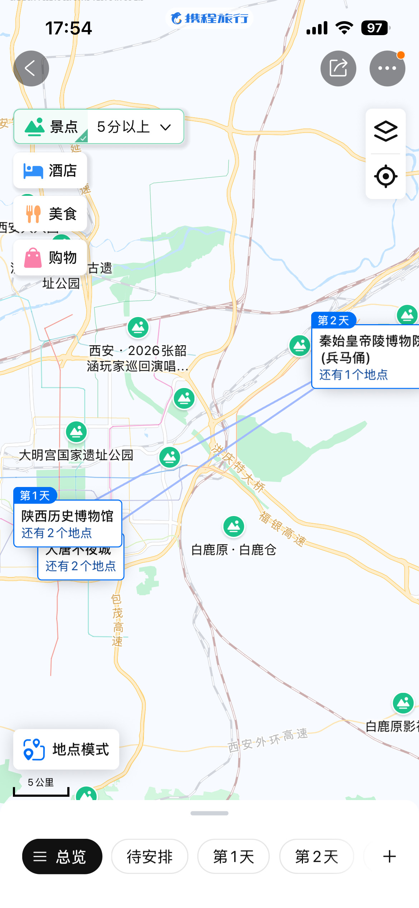
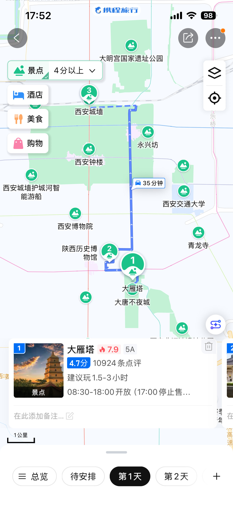
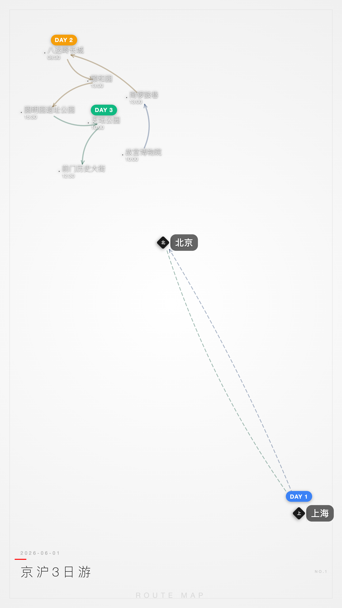
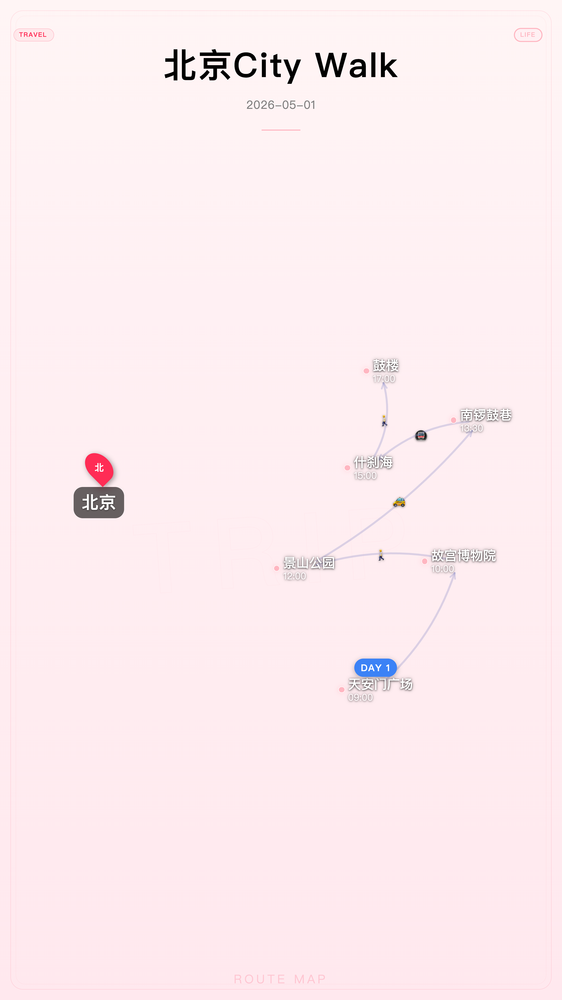
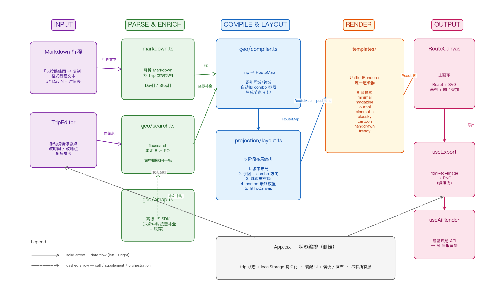

# 探Way / tanway

> 把整趟旅程压到一张图上：方位保真、距离压缩，同城景点聚成一组，跨城段用带交通图标的弧线连接，不画道路细节。粘贴 Markdown 行程，导出 PNG 直接分享。

[](./LICENSE)
[](https://github.com/luvrix/travel/actions/workflows/ci.yml)
[](https://github.com/luvrix/travel/actions/workflows/deploy.yml)

## Background

普通地图工具（高德、Google Maps）画旅行路线有两个体验问题：

- **距离畸变**：A/B/C 相距 100m、D 相距 100km 时，缩放到 D 看 ABC 挤成一坨，缩放到 ABC 则 D 出视野。
- **道路冗余**：默认按实际道路绘制路径，但分享场景只想表达「A → B 用了什么交通方式」，不需要道路细节。

<table>
  <colgroup>
    <col style="width: 50%">
    <col style="width: 50%">
  </colgroup>
  <tr>
    <th align="center">距离畸变</th>
    <th align="center">道路冗余</th>
  </tr>
  <tr>
    <td align="center"></td>
    <td align="center"></td>
  </tr>
</table>

探Way 用 rank-based 极坐标投影 + d3-force 碰撞修正解决这两点：方位关系保真，距离非线性压缩；同城景点聚成 combo，跨城段用带交通图标的弧线连接，景点间走直线不画道路。

## Features

- **保向压缩布局** —— 最近的点不挤、最远的点不溢出，无需调参
- **城市分组** —— 同城景点聚成 combo 容器，跨城用弧线连接
- **Markdown 导入** —— 粘贴小程序「长按路线图 → 复制行程文字」格式的文本直接生成地图
- **8 套渲染模板** —— minimal / magazine / journal / cinematic / bluesky / cartoon / handdrawn / trendy
- **AI 海报渲染** —— 导出透明底路线图，调硅基流动 API 生成风格化背景
- **高德地理编码补全** —— 本地数据库（约 21 万条 POI）未命中的地点按需调 Vercel Edge Function 代理高德查询（key 不暴露到前端）
- **多画布比例** —— 抖音 1080×1920 / 小红书 1080×1440 / 微信 1280×1184 / 自定义
- **图片叠加** —— 拖入照片到画布，支持裁剪、旋转、去背景
- **localStorage 持久化** —— 行程自动保存，刷新不丢

## Quick Start

```bash
git clone <repo-url>
cd travel-master
npm install
npm run dev
```

浏览器打开 `http://localhost:5173/travel/`。默认加载一份「北京3日游」demo 行程，可直接看到效果。

## Input Format

侧边栏可手动编辑停靠点，也可点击「导入行程」粘贴 Markdown。

### Examples

> 行尾 ` @lat,lng` 可选 — 写了就用嵌入坐标；再带 ` #城市` 时 city 直接读 markdown、不查 DB，不带则按坐标查本地 DB 拿 city（多同名 POI 按坐标消歧）。不写坐标则按名字查本地 DB，未命中再调高德。同名 POI 消歧（景山公园/鼓楼/西湖 全国几十个）建议带坐标。下方示例的所有 POI 都在本地库（约 21 万条）中可命中，坐标用于消歧与跨设备复现。

#### 跨城往返：京沪3日游

```markdown
# 京沪3日游
2026-06-01

## Day 1
- 07:00 上海 @31.203889,121.453300 #上海
- 10:00 飞机 故宫博物院 @39.917400,116.390800 #北京
- 13:00 打车 南锣鼓巷 @39.932100,116.396800 #北京

## Day 2
- 08:30 大巴 八达岭长城 @40.357200,116.009300 #北京
- 13:00 颐和园 @39.996700,116.275800 #北京
- 15:30 圆明园遗址公园 @40.005100,116.297200 #北京

## Day 3
- 10:00 天坛公园 @39.879900,116.404200 #北京
- 12:30 前门历史大街 @39.893400,116.391900 #北京
- 18:00 飞机 上海 @31.203889,121.453300 #上海
```

#### 单城 City Walk：北京一日

```markdown
# 北京City Walk
2026-05-01

## Day 1
- 09:00　天安门广场 @39.9024,116.3915 #北京
- 10:00　故宫博物院 @39.9174,116.3908 #北京
- 12:00　步行 景山公园 @39.9244,116.3904 #北京
- 13:30　打车 南锣鼓巷 @39.9321,116.3968 #北京
- 15:00　地铁 什刹海 @39.9380,116.3871 #北京
- 17:00　步行 鼓楼 @39.9393,116.3897 #北京
```

#### 多城串联：苏杭3日

```markdown
# 苏杭3日
2026-05-10

## Day 1
- 09:00　苏州站 @31.3313,120.6089 #苏州
- 10:00　步行 拙政园 @31.3260,120.6246 #苏州
- 12:00　狮子林 @31.3234,120.6247 #苏州
- 14:00　山塘街 @31.3201,120.5975 #苏州
- 18:00　高铁 杭州 #杭州

## Day 2
- 09:00　西湖 @30.2375,120.1408 #杭州
- 11:00　雷峰塔 @30.2339,120.1450 #杭州
- 13:00　打车 灵隐寺 @30.2428,120.0968 #杭州
- 16:00　步行 河坊街 @30.2425,120.1648 #杭州

## Day 3
- 09:00　高铁 上海 #上海
- 11:00　外滩 @31.2403,121.4860 #上海
- 13:00　南京路步行街 @31.2381,121.4752 #上海
- 16:00　豫园 @31.2289,121.4878 #上海
```

<table>
  <colgroup>
    <col style="width: 33.33%">
    <col style="width: 33.33%">
    <col style="width: 33.33%">
  </colgroup>
  <tr>
    <th align="center">京沪3日游</th>
    <th align="center">北京City Walk</th>
    <th align="center">苏杭3日</th>
  </tr>
  <tr>
    <td align="center"></td>
    <td align="center"></td>
    <td align="center"></td>
  </tr>
</table>

### Syntax

| 元素 | 格式 | 必填 | 说明 |
|---|---|---|---|
| 标题 | `# 标题` | 是 | 行程名 |
| 日期 | `YYYY-MM-DD` | 否 | 起始日 |
| 日序 | `## Day N` | 是 | 区分天数 |
| 停靠点 | `- HH:MM [交通] 地点名 [@lat,lng] [#城市]` | 是 | 至少一行；时间在最前，方括号内是可选修饰符 |

**坐标嵌入**（`@lat,lng`）：可选，写在地名后。跨设备/跨用户复现一致，避免：
- 同名 POI 歧义（景山公园 在东莞+北京都有；鼓楼 全国 36 条；西湖 58 条）
- 高德查询结果因人/因时而异，复制 markdown 复现时地图会错位

**城市嵌入**（`#城市`）：可选，写在 `@lat,lng` 之后或地名之后。city 字段直接从 markdown 读，不查本地 DB，跨 DB 版本稳定（DB 升级改某 POI 的 city 字段后，导出再导入仍一致）。

不写坐标和城市时，按名字查本地 DB 拿坐标和城市；DB 未命中再调高德。

导出时若 stop 有坐标自动追加 `@lat,lng`（6 位小数），有 city 自动追加 `#city`，实现导出 → 导入的字段级可逆。

**交通方式关键词**（可选，写在时间后、地点前）：

| 关键词 | 图标 | 连线 |
|---|---|---|
| 飞机 | ✈️ | 跨城弧线虚线 |
| 高铁 | 🚄 | 跨城弧线虚线 |
| 大巴 / 自驾 | 🚌 / 🚗 | 直线虚线 |
| 打车 / 地铁 / 步行 / 骑行 | 🚕 / 🚇 / 🚶 / 🚲 | 直线实线 |

未指定交通方式时，同城默认步行，跨城默认飞机。

## Configuration

高德地理编码补全通过 Vercel Edge Function 代理（key 藏服务端，Upstash Redis 跨用户共享缓存，DigitalPlat 免费域名 + Cloudflare 橙云绕 SNI 阻断）。部署步骤见 [`worker/README.md`](./worker/README.md)，方案细节见 [`docs/geo-network.md`](./docs/geo-network.md)。

复制 `.env.example` 为 `.env` 并填入你的自定义域名：

```bash
cp .env.example .env
```

```
VITE_GEO_WORKER_URL=https://your-name.dpdns.org
```

**不部署也能用**：仅本地数据库（约 21 万条 POI）能命中。部署 Vercel 函数 + 自定义域名后，未命中的地点会按需调高德查询补全坐标。

AI 海报渲染需要硅基流动 API key，在「导出 → AI 渲染」面板里现场粘贴，不写入环境变量。

## Development Commands

```bash
npm run dev          # 启动 dev server
npm run build        # 类型检查 + 生产构建
npm run preview      # 预览构建产物
npm test             # 运行单元测试（vitest）
npm run test:watch   # 测试 watch 模式
npm run lint         # eslint
```

## Tech Stack

- React 19 + TypeScript + Vite 8
- d3-force（力导向碰撞修正）
- flexsearch（本地地理数据索引）
- html-to-image（PNG 导出）
- Tailwind CSS 4
- 高德 Web 服务 API（通过 Vercel Edge Function 代理 + Cloudflare 自定义域名）

## Architecture



## Data Sources

运行时按需加载分片数据：首屏 `public/data/cities.json`（60KB，389 城市带 province_slug）+ `public/data/idx/cities.json`（27KB flexsearch 索引）；用户行程涉及某省时再加载 `public/data/provinces/<slug>.json` + `public/data/idx/<slug>.json`。整体 21 万条 POI 分布在 34 个省份分片，单次行程通常只加载 1–2 个省，避免一次性加载全量数据。

原始 21 万条 POI 数据源代码（`scripts/data/geo.json` 29MB）不在 public/ 下，仅作 build 脚本输入，由 `scripts/split-geo-by-province.mjs` 切分为分片。数据本身由 `scripts/collect/` 下多源采集脚本抓取（5A 景区 / Wikidata / DBpedia / UNESCO / GeoNames / OSM / 台湾县界），`merge_dedupe.py` 按城市 polygon 归属去重合并。

`scripts/data/geo_global.json` 是 GeoNames 全球数据中间产物，仅本地补全/对照用。

## License

[MIT](./LICENSE)
